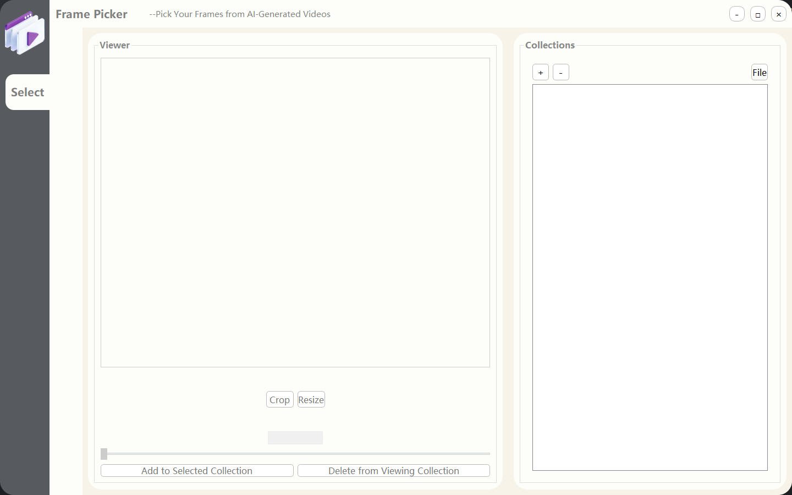
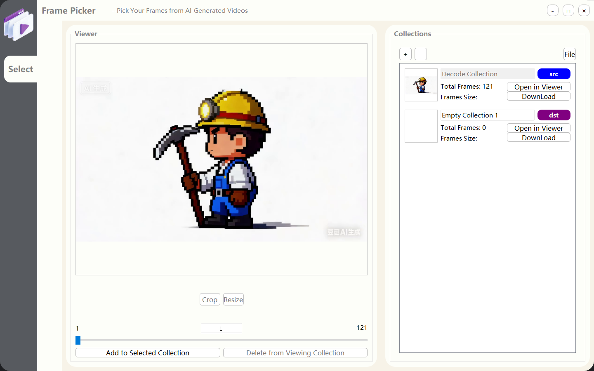
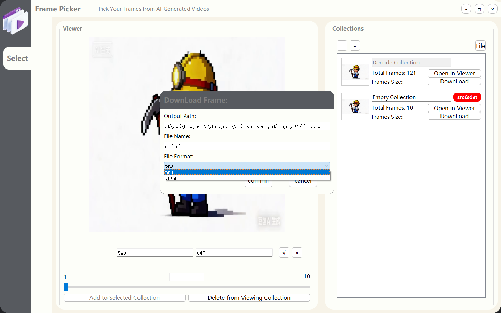
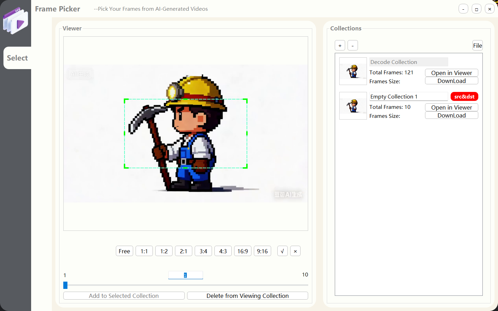
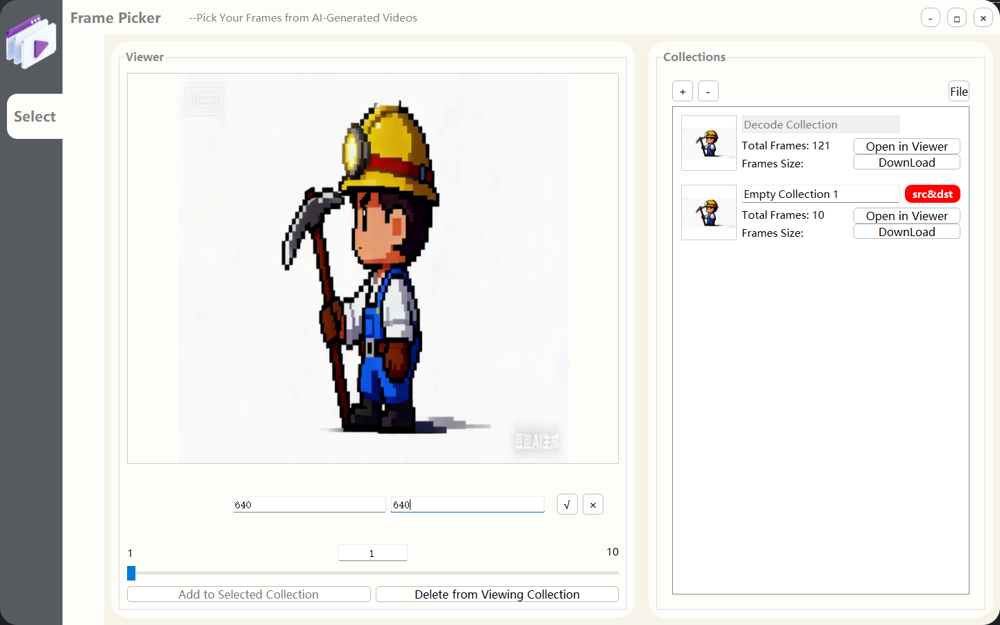

## Detail Workflow
### Main Window

### Collection
> - Mainly operate the dst collection
> - Support operations on the src collection as well

1.Use button `[File]` to select a source video file then create a decoded frame collection.

Attention: It can only decode 500 frames at most now.

2.Use button `[+]` to create an empty collection.

3.Click a collection to set it as a destination collection(dst).

4.Click button `[Open in viewer]` to set it as a source collection(src).

5.Click `[Add to Selected Collection]` means add the viewing frame to the `[dst]` collection.

6.Click `[Delete from Viewing Collection]` means delete the viewing frame from the `[src]` collection. (this can only available when `[src] == [dst]`).

7.Use button `[-]` delete the collection selected in `[Collections]` list.

8.Use `[DownLoad]` to export all the frames in the collection as picture with custom format.

### Viewer
> - Mainly Operate the src collection
1. Use `[Crop]` to crop all the frames in `[src]` collection.

2. Use `[Resize]` to resize all the frames in `[src]` collection.
